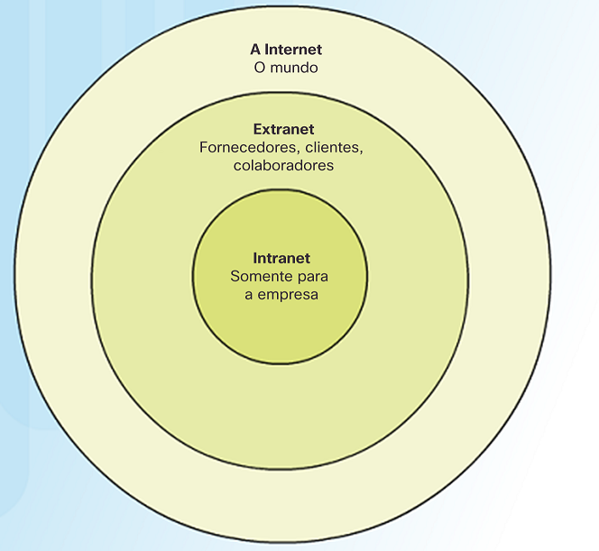

# Topologia

### A infraestrutura de rede possui três amplas categorias:

* Dipositivos 
* Meio físico
* Serviços

## Dispositivos Finais:

Dados se originam e são recebidos pelos dispositivos finais, fluindo por uma rede

 

## Dispositivos Intermediários:

Esses interconectam dispositivos finais na rede. Exemplos:

Switches, roteadores e firewalls.

Além da conexão, é também função dos intermediários:

* Regenerar e retransmitir sinais
* Manter informações sobre os caminhos da rede
* Notificar erros e falhas

 

## Meio físico de rede

Responsáveis pela comunicação entre dispositivos de uma rede, as mais comuns são:

* Fios metálicos (como cobre)
* Vidro (como os cabos de fibra óptica)
* Transmissão sem fio

 

# LANs e WANs

## LAN

A **rede de área local** abrange pequenas áreas, sendo administrada por uma única pessoa ou por pequenos setores.

 

## WAN

Já a **rede de longa distância** abrange uma área maior, geralmente usadas por provedores de serviços de telecomunicações.

 

## Diferenças entre LAN e WAN

LAN   | WAN
--------- | ------
Pequenas áreas | Grandes áreas
Administradas por uma pessoa ou um pequeno grupo | Administradas por vários prestadores de serviço
Alta velocidade | Baixa velocidade

 
A internet é um grande conjunto de LANs e WANs, as LANs estão conectadas por intermédio das WANs.

